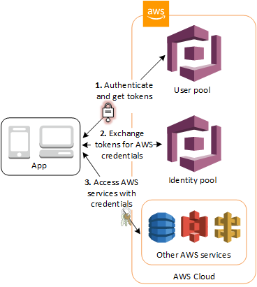

Auth is _hard_ to do well.  Like, for realsies.  Done correctly, it is far from trivial, but absolutely essential to get right.  This is exactly the problem AWS Cognito aims to solve. In Amazon's own words

>Amazon Cognito lets you add user sign-up, sign-in, and access control to your web and mobile apps quickly and easily.  

While there are many things that Cognito does extremely well, my experience with the popular service is anything less than quick **or** easy.  In this post, I'll *briefly* cover how Cognito works before describing a frustrating feature that has plagued Cognito users for **years**.

This problem took me *days* to wrap my head around and solve.  If you came here facing the same problem, I hope it saves you some time!

## How Cognito Works

At the risk of oversimplifying, AWS Cognito exists to answer two questions:

*  Who are you? (authentication)
*  What can you do? (authorization)

Cognito addresses these concerns with two distinct offerings: User Pools (authentication) and Identity Pools (authorization).  

### User Pools

You can think of Cognito User Pools as your applications user directory.  At a high level, User Pools let you handle user registration, authentication, account recovery and supports authentication with third party identity providers like Facebook, Google, etc.

### Identity Pools

Cognito Identity Pools provides a way to authorize your users to use various AWS services.  For example, if you needed to give your users access to upload a file to an S3 bucket or to invoke an endpoint in API Gateway, you could do so with an Identity Pool.  

### Cognito In Action

For the visual learners like myself, the process of using User Pools and Identity Pools looks like this



1.  Users sign-up and sign-in to your application via your Cognito User Pool.
2.  Your application fetches AWS credentials for your user.
3.  The logged in user can then use the credentials from step 2 to make calls to AWS resources (S3, API Gateway, etc)

I wont cover how to implement each of these steps in this blog post.  However, the fantastic [AWS Amplify Framework](https://docs.amplify.aws/) has client SDKs and [tutorials](https://docs.amplify.aws/lib/auth/getting-started/q/platform/js) that make the implementation a breeze.

## So What's The Problem?

Under the covers, User pools and Identity Pools each use their own unique identifiers to track a the **same users** identity. The problem is that AWS does not provide a mapping between these unique identifiers.

So what?

User Pools contain information about your user; email address, username, password, phone number, etc.  User Pools do _not_ know what permissions your users have.

Identity Pools contain information about user permissions; allow read access to an S3 bucket, allow access to invoke a specific API endpoint, etc.  Identity Pools do _not_ know any user information.

In AWS, user credentials are enforced by IAM policies using a users Cognito IdentityId (from the User Pool).  This can be a real problem if you ever need to relate user information (email address, username, phone number, etc) with a user action.

I think the problem may be more apparent if we walk through an example.

### S3 Private Folders

Imagine your application needs to allow users to upload a file to S3 that is only accessible to the individual user.  You would start by defining the following IAM policy:

```JSON
"Statement": [
    {
        "Effect": "Allow",
        "Action": [
            "s3:GetObject",
            "s3:PutObject",
            "s3:DeleteObject"
        ],
        "Resource": [
            "arn:aws:s3:::your-s3-bucket/${cognito-identity.amazonaws.com:sub}/*"
        ]
    }
]
```

The `${cognito-identity.amazonaws.com:sub}` is an IAM policy variable that resolves to the users unique identifier in the User Pool, also commonly called the users Cognito IdentityId.  

This will allow authenticated users in your application the necessary permissions to read/write/delete a file to a directory named after their Cognito IdentityId.  

Since Cognito gives you no way to map the IdentityId back to the user, you have absolutely no idea which user owns this S3 bucket.  This could pose a problem if you need to track a bug, provide user support for missing/failed uploads, track usage patterns for each user, etc.

## The Solution

I'll start with the bad news: there is no official AWS solution to this problem.  The problem has been identified time and again through [github issues](https://github.com/aws-amplify/amplify-js/issues/54), insightful [stackoverflow questions](https://stackoverflow.com/questions/42386180/aws-lambda-api-gateway-with-cognito-how-to-use-identityid-to-access-and-update) and more Google results than you can shake a stick at.  It's _extremely_ frustrating.

In short, you'll need to maintain your own mapping between User Pool and Identity Pool information.  Here are a few workarounds to consider.

### A Client Side Workaround

If you're using AWS Amplify, getting a users Identity Id is not difficult.

```JavaScript
  import {Auth} from "aws-amplify";

  const user = await Auth.signIn(username, password);
  const credentials = await Auth.currentCredentials();

  console.log('Cognito identity ID:', credentials.identityId);
```

Once you have the IdentityId, you can pass it to the backend for storage (e.g. DynamoDB).  You could also save the IdentityId as a [custom User Pool attribute](https://docs.aws.amazon.com/cognito/latest/developerguide/user-pool-settings-attributes.html)

```JavaScript
await Auth.updateUserAttributes(user, {
  'custom:identity_id': credentials.identityId,
});
```

While this approach is simple, it relies on information that is sent from the client and cannot be trusted.  Nevertheless, it's a popular workaround due to it's simplicity.

### A Server Side Workaround

If you are not satisfied with a client side solution, you could follow the approach outlined [in a github comment](https://github.com/aws-amplify/amplify-js/issues/54#issuecomment-434401406) from an employee on the Cognito team:

1. Add a custom attribute to your user pools schema called identityId
2. Make it read-only to the client that your end users are authenticating with
Authenticate the end user
3. Get AWS credentials for the end user
4. If there is no identity id present in the user profile, call a Lambda using the AWS credentials from step 4 and provide the id token from the end user as a parameter.
5. In the lambda call Cognito Federated Identity's [GetId](https://docs.aws.amazon.com/cognitoidentity/latest/APIReference/API_GetId.html) and pass the id token for the end user in the logins map, this will return the identity id
6. In the lambda call [AdminUpdateUser](https://docs.aws.amazon.com/cognito-user-identity-pools/latest/APIReference/API_AdminUpdateUserAttributes.html) to set the IdentityId profile attribute to the value returned in step 6
7. Optionally refresh the end users' user pool tokens so they will have the identity id in them


While this solution is clever and addresses the client side limitation, I find it complex and painful.  

## Conclusion

Cognito is an _extremely_ powerful solution to a fairly complex problem.  However, I find the disconnect between User Pools and Identity Pools a massive shortcoming.  What's _more_ frustrating, is that AWS has not been responsive to addressing this problem _or_ offer an official workaround while a solution is implemented.  

One of the benefits of using a service like Cognito is to *increase* developer velocity.  Auth is hard and developers shouldn't need to be security experts to integrate such a feature in their applications.  

When it comes to Cognito, you can forget about being shielded from the details.  You are going to need to roll up your sleeves and spend days wrapping your head around many complex topics.  
